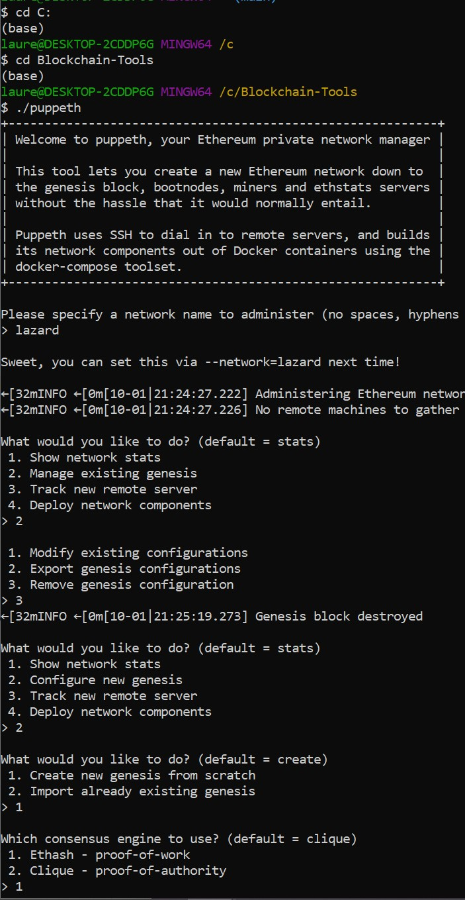

## Create genesis/network ##
Started by creating a new network called lazard running 'puppeth' using GitBash Terminal. 
Followed the prompts as seen in below screenshot. 

         1. Picked 2nd option, Configure new genesis
         2.  option 1, create new genesis from scratch
         3.  option 1, Proof of Work
         4. entered pre-funded ethereum wallet address
         5. contnue with default option
        6. select chain ID

    

## Creating Node 1 & 2 ##
Continuing in same prompt as creating new network, exported genesis configuration to .json file -  lazard.json
Ran nodes 1 & 2 as seen in below screenshot

         1. from previous command, type 2 to navigate to Manage existing genesis
        2. option 2, export existing genesis
        3. Exit puppeth by using the Ctrl+C keys combination. Create first node's data directory using the geth command. wait for success message:
            ./geth account new --datadir node1
        4. repeat to create 2nd node using geth command: 
            ./geth account new --datadir node2

        5. Now initialize nodes 1 & 2 by including network json file:
       node 1 - ./geth init lazard.json --datadir node1
       node 2 - ./geth init lazard.json --datadir node2

    

## Mining Blockchain ##
Opening a new terminal window navigating to 'Blockchain-Tools' folder to launch node 1 to begin minning, and node 2 to expose RPC port to communicate with MyCrypto per below screenshot

    1. launch node 1 using following command:
        ./geth --datadir node1 --mine --miner.threads 1
    2. copy/label the self-node address to notepad as this will need to use to run node 2.
    3. in another terminal, navigate to Blockchain-Tools folder and launch node 2 using the following command which includeds the enode address of node 1:
        ./geth --datadir node2 --port 30304 --rpc --bootnodes "enode://5d3ee58b9c4799d36785b52702bb663937d7922c80b4b42f7e7c4975ddea1184c402c8376cc128ddcb941b6d86669979e2c28bf5955da20b1754bb9423188e7c@127.0.0.1:30303" --ipcdisable
Now blockchain on lazard network is running.

    
    
    

## Make MyCrypto Transaction ##
With blockchain running and connecting to MyCrypto app, we can now create a custom node to the lazard network we created above.

    1. Select change network at bottom left anf then select 'Add Custom Node"
    2. In node name and netowkr name we enter genesis network name we created earleir - lazard
    3. for network, select 'custom' in the dropdown
    4. Curreny select ETH
    5. Chain ID type same ID created earleir - 323 
    6. for URL, we use the default RPC port on local machine:
         http://127.0.0.1:8545
    7. save and slect as network by logging in using private key used to create wallet.

    
    

Now we can make a transaction with funded wallet.

    1. copy and paste account adress to "To Address" field and fill amount of ETH
    2. click "send transaction" and "send"
    3. receive green message pop-up to show succesfull transaction.
    4. select "Check TX Status"

    
    

    
    
